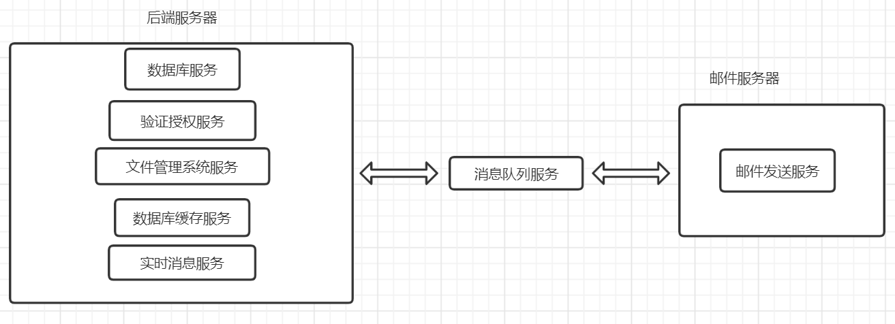

# weshare
## 项目介绍
一个前后端分离的共享相册网站，前端使用vue框架，后端使用springboot框架，实现相册共享、照片上传、照片评论和评论回复等功能。
## 项目功能
- 实现注册登录功能
- 实现共享群功能
  - 用户可以创建共享群，共享群的创建者可以修改、删除该群
  - 共享群的信息包括名称、创建时间、邀请码、验证码、封面、创建者
  - 用户可以分享共享群，通过共享群的邀请码（UUID）和验证码，新用户可以加入共享群 
- 实现相册功能
  - 用户可以在共享群内创建相册，相册的创建者可以修改、删除自己创建的相册
  - 相册信息包括相册名称、创建时间、封面、创建者
  - 同一共享群内的相册对群内所有参与者可见，对未参与该群的用户不可见
- 实现照片共享功能
  - 用户可以在相册内上传照片，照片的上传者可以删除自己上传的照片
  - 照片信息包括上传时间、上传者、所属相册、在文件系统的保存路径
- 实现评论功能
  - 用户可以对照片进行评论，也可以回复其他用户的评论，用户可以删除自己的评论
- 实现消息发送功能
  - 在以下情况下网站会向用户发送信息
    - 用户注册成功
    - 共享群新增相册
    - 共享群新增用户
    - 共享群被删除
    - 相册信息被修改
    - 相册被删除
  - 网站会通过邮件发送上述消息
  - 网站也会向网页端发送上述消息      
  
## 项目结构

## 技术栈
- 服务器：阿里云ecs服务器
- 前端框架：开源项目[vue-manage-system](https://github.com/lin-xin/vue-manage-system),Vue3 + pinia + Element Plus,使用nginx处理跨域问题
- 后端框架：springboot
  - 验证授权服务：[spring security](https://blog.saltroping.com/2021/04/12/%E8%AE%B0%E4%B8%80%E6%AC%A1%E4%BD%BF%E7%94%A8-springboot-spring-security-vue-%E7%9A%84%E5%89%8D%E5%90%8E%E7%AB%AF%E5%88%86%E7%A6%BB%E6%9D%83%E9%99%90%E8%AE%A4%E8%AF%81/)
  - 数据库服务：[Mysql+mybatis](https://www.wolai.com/rYAoeiSK9o6dc4qVEn76hw)
  - 文件管理系统服务：[fastdfs+nginx](https://my.oschina.net/u/4271232/blog/5017286)
  - 数据库缓存服务：[spring cache+redis](https://bloodhunter.github.io/2019/09/12/redis-cache-with-spring-boot/)
  - 实时消息服务：[websocket](https://www.jc2182.com/springboot/spring-boot-websocket.html)
  - 消息队列服务：rabbitmq
  - 邮件发送服务：spring-boot-starter-mail

## 项目部署
- 前端部署：参照[vue-manage-system](https://github.com/lin-xin/vue-manage-system)
- 后端部署：将项目打包成jar后，准备以下环境
  - Mysql
  - redis
  - rabbitmq
  - fastdfs
  - 配置weshare-server中application.yml文件，配置message-server中的application.properties文件，修改自己的邮箱
  - 完成以上准备后，在服务器运行jar包即可访问

## 项目实现
- [跨域问题解决](项目实现/跨域问题解决.md)
- [数据库设计](项目实现/数据库设计.md)
- [spring security实现注册登录功能](项目实现/spring%20security实现注册登录%20功能.md)
- mysql+[mybatis](https://mp.weixin.qq.com/s?__biz=Mzg2NTAzMTExNg==&mid=2247483788&idx=1&sn=aabf8cf31d7d45be184cc59cdb75258c&scene=19#wechat_redirect)+[druid](https://mp.weixin.qq.com/s?__biz=Mzg2NTAzMTExNg==&mid=2247483786&idx=1&sn=f5f4ca792611af105140752eb67ce820&scene=19#wechat_redirect)实现数据库的增删查改
- [fastdfs实现图片上传和下载功能](https://my.oschina.net/u/4271232/blog/5017286)
- [redis实现缓存](https://bloodhunter.github.io/2019/09/12/redis-cache-with-spring-boot/)
- rabbitmq实现不同服务器的通信
- [websocket实现网站消息实时更新](https://www.jc2182.com/springboot/spring-boot-websocket.html)